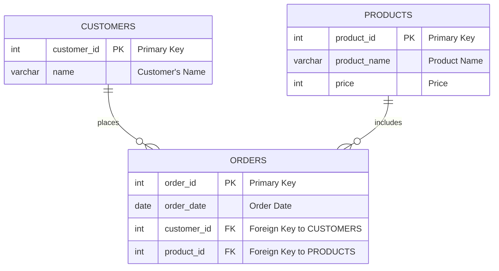

# The Most Frequently Ordered Products for Each Customer

## Problem Statement

Given three tables: `Customers`, `Orders`, and `Products`, the goal is to write an SQL query to find the most frequently ordered product(s) for each customer. The result should include the `product_id` and `product_name` for each `customer_id` who has made at least one order. The result can be returned in any order.

### Tables Structure

- **Customers**
  - `customer_id` (int): Primary key. Unique identifier for the customer.
  - `name` (varchar): Name of the customer.

- **Orders**
  - `order_id` (int): Primary key. Unique identifier for the order.
  - `order_date` (date): The date when the order was placed.
  - `customer_id` (int): Identifier for the customer who made the order.
  - `product_id` (int): Identifier for the ordered product.
  - Note: No customer will order the same product more than once on a single day.

- **Products**
  - `product_id` (int): Primary key. Unique identifier for the product.
  - `product_name` (varchar): Name of the product.
  - `price` (int): Price of the product.

### Objective

Identify the most frequently ordered product(s) for each customer based on the data provided in the `Orders` table. Include in the result each customer who has placed at least one order, along with the `product_id` and `product_name` of their most frequently ordered product(s).

### Example

Given the following data:

- **Customers Table:**

| customer_id | name  |
|-------------|-------|
| 1           | Alice |
| 2           | Bob   |
| 3           | Tom   |
| 4           | Jerry |
| 5           | John  |

- **Orders Table:**

| order_id | order_date | customer_id | product_id |
|----------|------------|-------------|------------|
| 1        | 2020-07-31 | 1           | 1          |
| 2        | 2020-07-30 | 2           | 2          |
| 3        | 2020-08-29 | 3           | 3          |
| 4        | 2020-07-29 | 4           | 1          |
| 5        | 2020-06-10 | 1           | 2          |
| 6        | 2020-08-01 | 2           | 1          |
| 7        | 2020-08-01 | 3           | 3          |
| 8        | 2020-08-03 | 1           | 2          |
| 9        | 2020-08-07 | 2           | 3          |
| 10       | 2020-07-15 | 1           | 2          |

- **Products Table:**

| product_id | product_name | price |
|------------|--------------|-------|
| 1          | keyboard     | 120   |
| 2          | mouse        | 80    |
| 3          | screen       | 600   |
| 4          | hard disk    | 450   |

- **Result Table:**

| customer_id | product_id | product_name |
|-------------|------------|--------------|
| 1           | 2          | mouse        |
| 2           | 1          | keyboard     |
| 2           | 2          | mouse        |
| 2           | 3          | screen       |
| 3           | 3          | screen       |
| 4           | 1          | keyboard     |


### ER Diagram

To visualize the relationships between the `Customers`, `Orders`, and `Products` tables, an ER diagram can be created using Mermaid syntax as follows:


### Solution

The provided SQL query successfully calculates the most frequently ordered products for each customer by:

1. Counting the number of times each product was ordered by each customer.
2. Identifying the maximum order count for each customer.
3. Joining the results with the `Products` table to include the `product_name`.

```sql
WITH
    orders_count AS (
        SELECT
            customer_id,
            product_id,
            COUNT(product_id) AS orders_count
        FROM
            orders
        GROUP BY
            customer_id, product_id
    ),
    max_orders_count AS (
        SELECT
            customer_id,
            MAX(orders_count) AS max_orders_count
        FROM
            orders_count
        GROUP BY
            customer_id
    )

SELECT
    o.customer_id,
    o.product_id,
    p.product_name
FROM
    orders_count o
    INNER JOIN max_orders_count m
    ON o.customer_id = m.customer_id
    AND o.orders_count = m.max_orders_count
    INNER JOIN products p
    ON o.product_id = p.product_id
```
