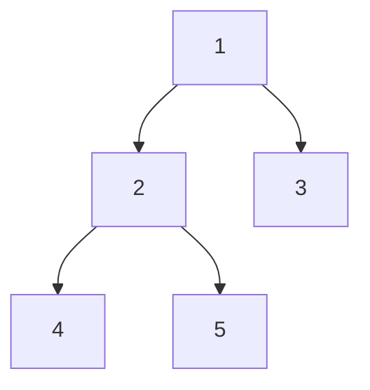

# Tree Node Types Problem

## Problem Statement

Given a table `tree`, where `id` is the identifier of the tree node and `p_id` is its parent node's id, classify each node in the tree as one of three types:

- **Leaf**: If the node is a leaf node (no children).
- **Root**: If the node is the root of the tree (no parent).
- **Inner**: If the node is neither a leaf node nor a root node (has both parent and children).

### Example Input

| id | p_id |
|----|------|
| 1  | null |
| 2  | 1    |
| 3  | 1    |
| 4  | 2    |
| 5  | 2    |

### Expected Output

| id | Type  |
|----|-------|
| 1  | Root  |
| 2  | Inner |
| 3  | Leaf  |
| 4  | Leaf  |
| 5  | Leaf  |

### Explanation

- Node '1' is the root node, as its parent node is NULL, and it has child nodes '2' and '3'.
- Node '2' is an inner node, as it has a parent node '1' and child nodes '4' and '5'.
- Nodes '3', '4', and '5' are leaf nodes, as they have a parent node but do not have any child nodes.

### Diagram



This diagram represents the tree structure described in the example input.

## Solution

The SQL query to solve this problem:

```sql
SELECT
    parent.id,
    CASE
        WHEN p_id IS NULL THEN 'Root'
        WHEN EXISTS (SELECT 1 FROM tree leaf WHERE leaf.p_id = parent.id) THEN 'Inner'
        ELSE 'Leaf'
    END AS type
FROM
    tree parent
ORDER BY
    parent.id;
```

This query classifies each node as 'Root', 'Inner', or 'Leaf' based on the presence of parent and child nodes and sorts the result by the node id.
