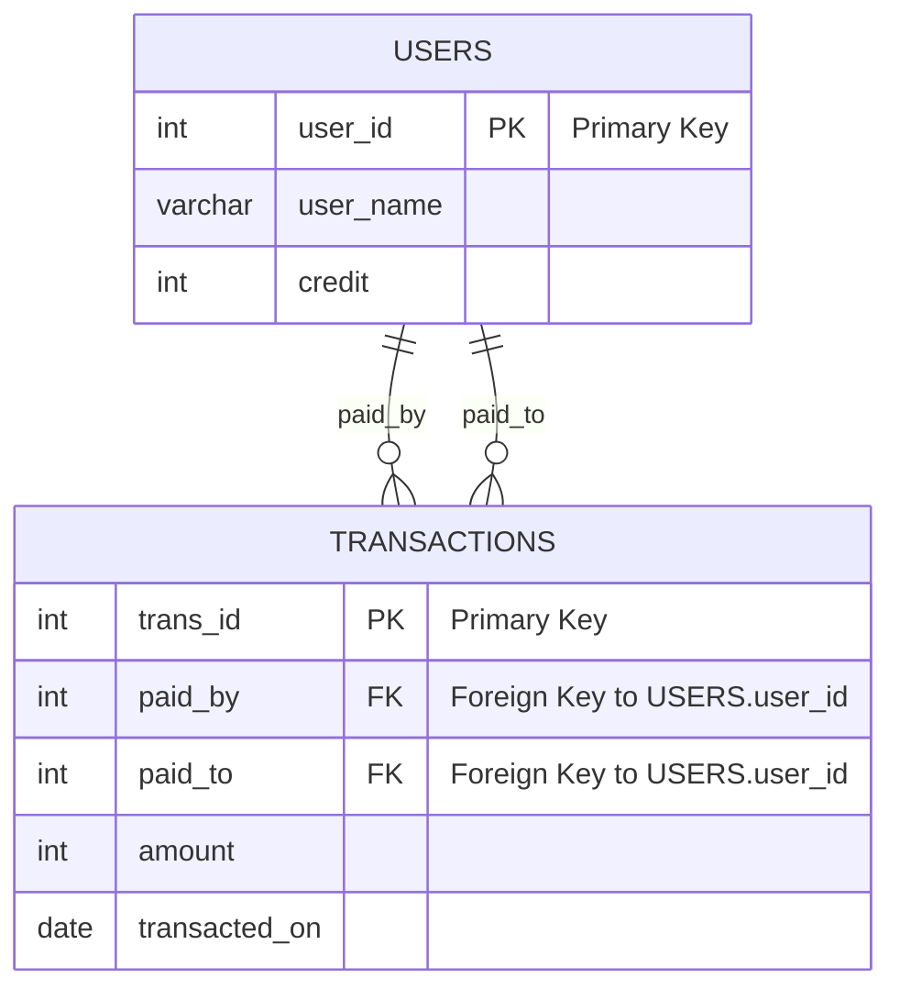

# Bank Account Summary

## Problem Statement

Codestudio Bank (CSB) facilitates its users with a platform for making virtual payments. The bank maintains a record of all transactions in a database, which includes information about the users and their transactions. The goal is to calculate the current balance of all users after performing transactions and to determine whether they have breached their credit limit (i.e., if their current credit is less than 0).

## Tables Structure

### Users Table

| Column Name | Type    |
|-------------|---------|
| user_id     | int     |
| user_name   | varchar |
| credit      | int     |

- `user_id` is the primary key for this table.
- Each row contains the current credit information for each user.

### Transactions Table

| Column Name   | Type |
|---------------|------|
| trans_id      | int  |
| paid_by       | int  |
| paid_to       | int  |
| amount        | int  |
| transacted_on | date |

- `trans_id` is the primary key for this table.
- Each row contains information about the transaction in the bank, where a user (`paid_by`) transfers money to another user (`paid_to`).

## Objective

Write an SQL query to report:
- `user_id`
- `user_name`
- `credit` (current balance after performing transactions)
- `credit_limit_breached` (check credit limit, "Yes" or "No")

Return the result table in any order.

## Example

### Users Table

| user_id | user_name | credit |
|---------|-----------|--------|
| 1       | Moustafa  | 100    |
| 2       | Jonathan  | 200    |
| 3       | Winston   | 10000  |
| 4       | Luis      | 800    |

### Transactions Table

| trans_id | paid_by | paid_to | amount | transacted_on |
|----------|---------|---------|--------|---------------|
| 1        | 1       | 3       | 400    | 2020-08-01    |
| 2        | 3       | 2       | 500    | 2020-08-02    |
| 3        | 2       | 1       | 200    | 2020-08-03    |

### Result Table

| user_id | user_name | credit | credit_limit_breached |
|---------|-----------|--------|-----------------------|
| 1       | Moustafa  | -100   | Yes                   |
| 2       | Jonathan  | 500    | No                    |
| 3       | Winston   | 9900   | No                    |
| 4       | Luis      | 800    | No                    |

## ER Diagram (Mermaid)



## Solution

```sql
WITH
    paid AS
        (SELECT
             paid_by     AS user_id,
             SUM(amount) AS amount
         FROM
             transactions
         GROUP BY paid_by)
  , received AS
        (SELECT
             paid_to     AS user_id,
             SUM(amount) AS amount
         FROM
             transactions
         GROUP BY paid_to)
  , balance AS
        (SELECT
             users.user_id,
             user_name,
             users.credit - COALESCE(paid.amount, 0) + COALESCE(received.amount, 0) AS credit
         FROM
             users
             LEFT JOIN paid ON users.user_id = paid.user_id
             LEFT JOIN received ON users.user_id = received.user_id)
SELECT
    user_id,
    user_name,
    credit,
    IIF(credit < 0, 'Yes', 'No') AS credit_limit_breached
FROM
    balance;
```